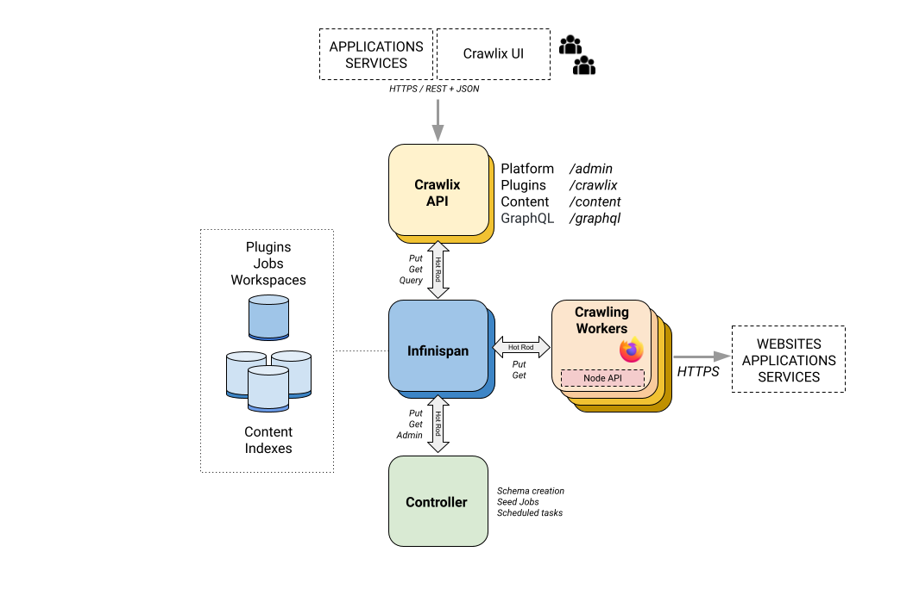

# CrawliX - A Web Content Extraction platform

CrawliX is a **crawling platform** that enables the configuration of automated navigation and parsing jobs 
through websites and applications, through headless browsers, extracting, saving the retrieved content and resources 
for later retrieval, analysis and querying. 

All content, such text or html fragments, images or screenshots, is **indexed** and can be **queried** through 
a simple **REST** and **GraphQL** APIs, which makes it convenient for easy consumption by other services and applications. 
Content entries are subject to **retention** policies.

## Features
The project is currently under active development, and provides the following general capabilities:

* Support for multiple workspaces, with full data isolation to enable multi-project and multi-tenancy capabilities.
* Simple token based authentication and authorization. 
* End user REST API to create and manage crawler plugins, supporting both synchronous and asynchronous executions.
* Content query API, through REST and GraphQL.
* Administrative REST API to manage the crawling nodes and workspaces.
* Simple lightweight Javascript library that simplifies the creation of the crawlers (plugins) while allowing to use all the browser's capabilities if needed.
* The data retrieved in the browser gets stored in one or multiple persistent caches, ready for querying, with custom expiration policies.
* Discovered URLs allow for automatic site deep navigation.
* Scalability, multiple browser nodes can be deployed at once, and will coordinate among them to work over the crawling jobs queue.

CrawliX is based on [Quarkus](https://quarkus.io/), [Infinispan](https://infinispan.org) and [Selenium](https://www.selenium.dev/documentation/).

-----

## Applications:

There are countless applications for data extraction from websites and web applications, such as:
* Content aggregation
* Competitive analysis
* Website health monitoring
* Application integrations
* Website monitoring
* AI models training

-----

## Architecture Overview

CrawliX is composed of the following main components, each one supported through a container image that can be escalated to multiple nodes. 

### 1. Key-Value data store, caching, indexing and search with Infinispan ###
[Infinispan](https://infinispan.org) is a scalable data store and caching provider. CrawliX takes advantage of some of its advanced capabilities, 
such as dynamically creating caches, set expiration policies or querying data. 
Using it through its Quarkus extension provides an easy mapping to the necessary Java objects, through simple annotations.
  
The data store acts as the central point of coordination for both the controller and the crawler nodes, to exchange data, 
coordinate over queues of work and keep the parsing and extraction results, for later retrieval.

### 2. The CrawliX service ###
This set of containers provides the following Restful APIs:

- Administration of crawlers */crawlix*. Configure crawlers, execute them and get their status.
- Platform administration at */admin*. Manage workspaces and security tokens.
- Content search at */content* and GraphQL. Retrieve content by query.

### 3. The crawler nodes ###
Each crawler node container has an **embedded Firefox**, that is initialized and controlled for every crawling job. Each node
has an inner loop that looks for pending crawling jobs, lock one of them and runs the headless Firefox. The necessary 
Javascript is injected and the execution results are either store as content for later query, or subsequent crawl jobs are created.

### 4. The controller ###
This component takes care of setting up the system, and perform regular tasks:
- Create or update the Infinispan schema on startup
- Periodically, create the seed crawling jobs.

## Architecture Diagram


-----

## Running CrawliX in development mode

### Pre-requisites

- Java 11+
- Podman, for building and executing images. Docker can be used as well, although scripts are not provided, yet.
- Firefox, in the PATH
- jq tool in the PATH

### **Step 1**. Start Infinispan
```
podman rm infinispan

podman run --name infinispan --network=host -e USER=kynerix -e PASS=crawlix quay.io/infinispan/server:latest
```
The Infinispan console will become available at http://localhost:11222/console/welcome

### **Step 2**. Start the Controller Service in Quarkus dev mode
```
cd controller/scripts

./dev-mode.sh 
```

The crawliX controller will start in **port 8079** and **debug port 5005**


### **Step 3**. Start one crawler node in Quarkus dev mode
```
cd crawler-node/scripts

./dev-mode.sh 
```

The crawliX node will register itself and will start in **port 8078** and **debug port 5004**

### **Step 4**: Check everything is in place:

- Access the Infinispan console with user *kynerix* and password *crawlix* at http://localhost:11222/console/welcome


- Check the service:
```
curl -s -X  GET "http://localhost:8079/crawlix/list-plugins" --header "Authorization: 00-DEFAULT-TOKEN-00" | jq
```

- Check the node's health:

```
curl -s -X GET -H "Content-Type: application/json" -H "Authorization: 00-DEFAULT-ADMIN-TOKEN-00" http://localhost:8079/admin/list-nodes | jq --tab
```

- Check the Swagger UI : http://localhost:8079/q/swagger-ui/

### **Step 5**: Start developing with Quarkus

